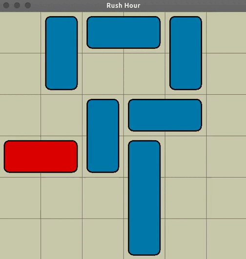

# **Rush Hour Animated Solver**
--------------------------------

We implemented an animated solver to the puzzle "rush hour". Our solver is implemented in Java, but we also give an experimental version coded in python in RushHour.ipynb, that is working well but not animated, and the classes are structured differently from the Java code. 
<p align="center">
  
</p>


## Rules of the game
--------------------
We dispose of a parking (board) with cars placed horizontaly or verticaly and eventually with different sizes. horizontal cars can only move horizontaly and vertical ones only verticaly.  
Only one main car is red while the others are blue. The objective is to enable this red car to reach the parking exit (the right side of the parking).


## Using the solver
------------------------

I implement here a breadth-first search (BFS) algorithm to solve rush hour puzzles.  

The classes Car, Parking and RushHour define the rules of the game, while the classes AnimatedSolverBFS and SolverBFS are solvers for the problem.  

Both classes implement the same algorithm and return the list of moves to solve the puzzle given an initial configuration. The difference is that AnimatedSolverBFS gives the possibility of visualizing the backtracking search of the optimal solution.  

The main file Program.cs gives an example of how to use the animated solver.  
We define in the same file 4 puzzles on a 6x6 grid: easyPuzzle, mediumPuzzle, hardPuzzle and hardestPuzzle, requiring respectively 6, ,16 ,26 and 51 moves to be solved. 

You can use the solver with one of them or define your own puzzle as in the following example
```
// initiate the puzzle and add cars
//---------------------------------
RushHour puzzle = new RushHour(width, height);

// puzzle.addCar(x, y, size,
//               orientation: Car.HORIZONTAL or Car.VERTICAL,
//               isRed : true or false); // false is the default value

puzzle.addCar(0,3,2,Car.HORIZONTAL, true); // the red car
puzzle.addCar(2,0,2,Car.HORIZONTAL);
puzzle.addCar(4,0,2,Car.VERTICAL); 
puzzle.addCar(3,3,3,Car.VERTICAL);	
puzzle.addCar(2,2,2,Car.VERTICAL);	 

// Create a panel for the animation
//---------------------------------
// the second argument specifies the animation speed
var animatedSolver = new AnimatedSolverBFS(puzzle, 2);
createFrame(animatedSolver);


// Solve and show optimal solution
//--------------------------------
// solve with backtracking animation
var winningMoves = animatedSolver.solve(); 


// solve without backtracking animation
var winningMoves = SolverBFS.solve(puzzle);


// show animation of the optimal solution
animatedSolver.playMoves(winningMoves);
```

The solvers are quite fast and need approximatively 75 milliseconds (with a processor i7 9Gen) to solve the most difficult puzzle on a 6x6 grid (puzzle taken from https://www.michaelfogleman.com/rush/), needing 51 moves.


## The Algorithm
----------------
We use a classic BFS approach to explore all the possible sequences of configurations, we keep a queue with the moves leading to these configurations and the moves for going back to parent configurations.  

Of course we must keep track of the visited configurations, for that we have a function intRepresentation in the class RushHour that defines an injection from the set of all possible configurations with the same cars to the set of positive integers (a hash function):  
if $M = max(Width, Height)$ and if we have $N$ cars, then each configuration can be matched to an $N$ vector $(p_1, \ldots, p_N) \in \{1,\ldots, M\}^N$ giving the positions of the cars (each car have only one variable coordinate, while the other is constant), which can itself be matched to an integer  
$$p_1 + p_2 M + p_2 M^2 \ldots + p_N M^{N-1}.$$

To better understand the algorithm see SolverBFS.solve().

